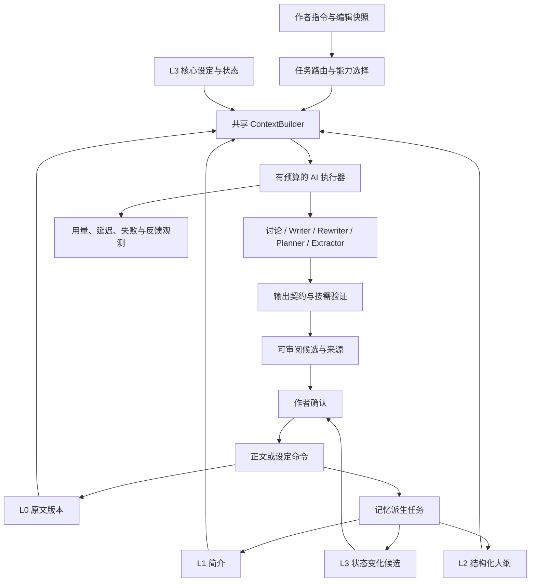

# Nai AI 应用架构专项评审

日期：2026-09-08；最终复审更新：2026-09-13。范围：模型调用、任务编排、Prompt、结构化输出、检索、四层记忆、工具、候选确认、评测和成本观测。通用数据库/保存问题见 [底层架构评审](底层架构评审.md)，模块与迁移拆分见 [架构实施蓝图](架构实施蓝图.md)。

> **最终复审注记（2026-09-13）**：下文第 1–5 节保留首次专项评审的发现和演进建议，不能单独代表当前状态。当前实现已完成显式 TaskRouter、ContextPack（含 L1/L2/L3 有界召回）、ModelResult、持久执行 job、候选采纳审计和 execution usage/latency 记录；对应逐项状态与证据见 [架构问题关闭清单](架构问题关闭清单.md) 和 [实施监督](实施监督.md)。仍未完成的是 12 例全量真实质量对照、作者盲评，以及 LM Studio 当前不可用时的模型质量验收。

## 1. 核心结论

目前 Nai 有多个可调用的 AI 功能，但缺少统一的 **任务→上下文→能力执行→可审阅结果→反馈** 链路。主对话是一轮单模型问答，高级续写是固定三阶段拼接，多维审核是另一套六路调用。长期小说记忆、能力选择和效果验证尚未贯通。

建议的 AI 核心为：**一个创作会话入口、共享四层上下文、按任务选用写作能力、类型化候选、作者确认回写**。先让一次写作的事实来源、失败状态和质量可验证，再决定哪里值得增加 Agent。

## 2. 当前实际执行路径

| 入口 | 实际 AI 行为 | 当前缺口 |
|---|---|---|
| 常驻创作对话 | WritingTurn 历史 + 有界正文/世界观/事实 → 单次模型调用 | 不调用高级工具，无结构化计划、长期记忆和统一执行 trace |
| 高级续写 | 检索 → A 写环境 → B 写人物 → C 整合正文 → 一致性检查；冲突时重跑 C | 三次串行生成没有质量对照证据；A/B 生成内容可能把后续引向未确认细节 |
| 大纲/部分创作接口 | 把任务要求拼进通用生成链 | 正文 Agent 的“不要总结、直接描写”与结构化大纲任务存在指令冲突 |
| 六维审核 | 节奏、质量、连贯、人物、文风、安全分别调用；全局并发上限默认 2 | Schema 校验已有，但模型打分没有作者标注集校准 |
| 角色 MCP | 受权的 CRUD、生成、分析与优化 | 能力清单可用不等于主对话已有工具选择/工具结果回传循环 |

代码依据：[writing_chat.py](backend/app/api/routes/writing_chat.py)、[agent_service.py](backend/app/services/agent_service.py)、[generation.py](backend/app/api/routes/generation.py)、[review_agent_service.py](backend/app/services/review_agent_service.py)。

现有三阶段图是固定工作流，没有自主决定工具及执行分支的通用 Agent 循环。产品界面应展示作者能理解的创作阶段，不把 Agent 数量当作效果指标。

## 3. 本轮确定性缺陷及修复

### F1 · P1：正文被再次解析为 Prompt 模板

六维审核使用 `("user", f"...{content}...")` 创建 ChatPromptTemplate。正文如 `主角打开{属性面板}`、JSON 或孤立 `{` 会被第二次当模板解析，在发到模型之前失败；连贯性审核的前文也存在同样问题。

已改成静态模板变量，正文/前文只作为 `ainvoke` 参数传入。新增六类审核测试，保留真实 LangChain 模板渲染与消息构建，仅替换模型结果，确认文本原样进入模型。

### F2 · P1：首章人物审核读取未来章节

原调用将第一章的 `max_chapter` 设置为 None，RAG 把它解释为无章节上限，因此第 1 章审核可能使用结局的人物状态。已修改：第一章不查询前文章节；后续章严格限定到当前章之前。该修复不等于第一章已完整注入角色卡，正式角色状态接入仍属于共享上下文改造。

### F3 · P2：重试诊断也可能破坏模板

剧情 Agent 把一致性反馈用 f-string 追加到 system 模板；含花括号的诊断导致纠错轮次在调用前失败。已将反馈作为有预算的变量传入，测试验证诊断完整进入消息且生成成功。

代码：[review_agents.py](backend/app/services/review_agents.py)、[agent_service.py](backend/app/services/agent_service.py)；回归：[test_ai_prompt_contracts.py](backend/tests/test_ai_prompt_contracts.py)。新测试修复前 8 项失败、1 项通过，修复后全部通过。模板数据边界修复解决语法重解释，不代表消除了模型层面的提示注入。

## 4. AI 架构待办（按优先级）

### A1 · P1：按任务选择能力，避免所有任务都走正文拼接

讨论、续写、选区改写、生成大纲、提取简介需要不同输入和输出契约。当前高级链固定要求 A/B 分别写 150–200/200–250 字，再由 C 整合，不能自然代表所有任务。大纲需要节点和因果，简介需要忠实提取，不能复用“增加描写、推进剧情”的系统目标。

建议先使用确定性 TaskRouter：讨论→问答；续写→Writer；改写→Rewriter；简介→DigestExtractor；大纲→OutlinePlanner；检查→Verifier。作者已在 UI 选择的模式优先，不为每条消息额外调用模型分类。含糊指令可以提出澄清或返回待确认计划，不能擅自变成正式设定修改。

Writer 默认先用一次完整生成作为对照基线。复杂章节可以增加结构化写作计划，但计划只能包含目标、场景、人物、约束和来源引用，不先生成几段“准事实正文”。现有三阶段链保留为可比较方案；是否替换由盲评、延迟与成本决定。

### A2 · P1：共享 ContextPack，并把四层记忆接入实际召回

当前主对话和高级续写已共用正式设定/有效 L1 的 ContextPack；高级链仍额外保留 RAG 路径。第一批改造已移除高级链的 `current_day=1` 硬编码：未知故事日按章节范围召回，不再过滤掉第 1 天之后的已发生事件；目标故事日未知时，无法定位章节的事件不自动注入。按日时间线检查在日期未知或参考缺失时明确跳过。角色检索固定搜索“主角”，没有根据当前场景识别具体人物；普通语义检索不能可靠回答“谁现在持有哪件物品”。

目标 `ContextPack`：scope、目标叙事位置、当前任务、当前编辑快照、L3 状态、L2 相关大纲、L1 相关简介、必要 L0 片段、近期交流、sources、omitted、warnings、fingerprint。

召回顺序：

1. 先按小说、生命周期、版本及生效位置过滤。
2. 人物/物品/关系优先通过稳定实体 ID 和结构化字段匹配；作者钉选的核心规则优先保留。
3. 再用关键词/向量查相关简介、场景和原文；去重，必要时再评估是否引入 reranker。
4. 细节不确定或来源冲突时下钻原文，不能只信摘要和模型置信度。
5. 统一预算，显示本次采用与省略的来源；没有检索结果、服务不可用、来源过期分别表达。

模型可用但 Embedding 不可用时，继续使用关系数据库中的正式设定和简介；不能让核心状态依赖向量检索是否成功。L3 高频不等于永久无上限注入，也不等于被反复提及的 AI 猜测自动成为真相。

### A3 · P1：统一模型结果契约，检查截断与输出用途

第一批已实现共享 `ModelResult`，对话、生成路由、AgentService、六维审核和轻量编辑均先检查完成原因、文本类型、空输出、工具请求及 20000 字符输出预算。`length` 等截断在对话中落为 `failed` 并保留问题，不产生可采纳正文；高级链和审核按现有错误协议终止。轻量编辑新增严格 Schema，缺字段或异常类型返回不可用，不补固定好评。角色/世界观等其他 JSON 任务仍需专用 Schema。

目标 `ModelResult` 包含文本/结构化结果、model/provider、finish_reason、usage、latency、错误分类。后续可增加独立 incomplete 状态；当前截断使用现有 failed 状态，不进入正常采纳状态；JSON 提取采用任务专用 Schema，拒绝错误类型、越界数据和跨小说出处。Provider 缺少某字段时明确 unknown，不杜撰 token 或费用。

已新增 `model_provider.create_chat_model`，后端 ChatOpenAI 构造集中于此，保留各任务原模型、温度和已有输出预算；轻量编辑补上原先缺失的全局输出上限、超时和重试设置。创作对话的预算消息构建与模型执行移入 `WritingService`，解除路由对生成路由的模型依赖。

后续模型参数按用途分 profile：忠实提取/分类优先稳定低随机性，正文生成单独配置。共享客户端工厂保留超时、输出上限和能力差异；不能假设所有 OpenAI 兼容服务都支持同一种结构化输出或流式 usage。

### A4 · P1：区分重试、修稿和重新生成，限制整轮成本

现有 C 在检查冲突后最多再生成两次；SDK 同时有网络重试。正常高级续写需要 A/B/C 共 3 次逻辑调用，冲突上限为 5 次。若每次配置 2 次 SDK 重试，最坏可能尝试 15 次模型请求，另有 Embedding；六维审核则为 6 次逻辑调用。这是代码结构上限估算，不是实测计费。

应分为：传输失败重试（有限退避）、结构错误修复（有限一次或明确失败）、内容冲突修稿（针对具体违规）、作者主动重新生成（新候选）。整轮需总 deadline、调用次数、输出 token 和工具次数上限，预算耗尽明确终止。

当前修稿只把违规说明再交给 C，同时继续使用原来的 A/B 内容，容易重新引入同一冲突；后续应提供上一版候选、带出处的具体问题、允许改动范围和不可破坏约束，验证问题确实消除。

### A5 · P1：工具运行与作者确认需要独立契约

每个能力声明：输入 Schema、输出类型、读/写性质、scope、所需来源、成本等级和是否需要作者确认。模型只获得允许的读取和提议工具；正式正文/事实写入经确认命令，不能由自然语言“我已经更新了”代替数据库成功。

运行记录至少包括 turn_id、execution_id、tool_call_id、参数摘要、返回候选/错误、来源版本和状态。执行中工具失败、拒绝确认、取消、过期候选都要回到当前对话。应用事务与来源保护沿用实施蓝图，不再创建平行版本协议。

初期按作者选择显式调用工具即可；只有确有复杂多步任务时，再加入有步数限制的自主选择循环。DSH 插件外部工具可用，不能代替网页端这套执行链。

### A6 · P1：建立质量评测，不能只看测试通过与模型自评分

现有测试能证明参数、权限、错误与状态协议，不能证明长篇续写好、人设稳定、伏笔记得住。六维分数和“可发布”阈值没有经作者标注集校准；同类模型评价自己的生成还会带来相关偏差。

最小评测方案（待建立）：从一部代表性作品挑 12 个固定任务，覆盖续写、改写、事实检索、大纲/简介，各类包含长上下文、未来剧情与改稿失效场景。每例保存来源版本、作者要求、必守事实、禁用未来信息、可接受结果标准，不把唯一参考文本当唯一正确答案。

先做可程序校验的层：JSON/schema、来源有效性、章节过滤、物品守恒、禁止改动范围、预算。再做作者盲评：人设、推进、文风、可采纳程度。LLM judge 只能辅助，保留判断依据并抽样人工复核。

对照：单 Writer vs 当前三阶段；无记忆 vs L1 vs 完整四层；固定历史 vs 按任务召回。分别记录质量、采纳率、修改幅度、失败率、p50/p95 延迟和 token，不以更多 Agent 自动推断质量提升。

### A7 · P2：Prompt、检索和模型调用缺少可比较观测

当前 workflow trace 有阶段、预览和耗时；A/B/C 生成节点已保留提供方实际返回的 model、usage 和 finish_reason，缺失为 null。尚未持久化或完整串起对话→模型→工具→来源→采纳；MCP 有 `ai_tokens_used` 字段，调用方未统一填入真实 usage。无法稳定回答一次续写为什么慢、用了哪些旧记忆、换模型后为何退化。

建议记录：execution_id、task_type、prompt/schema/model/embedding 版本、context fingerprint、source IDs、input/output/cached tokens（服务提供时）、finish_reason、模型/检索/排队耗时、重试次数、采纳/拒绝事件。日志默认记录元数据与受限预览，完整 Prompt 仅在明确调试配置下受控保存。

Prompt 和输出 Schema 随版本管理；模型升级跑同一评测集。成功请求不能掩盖检索失败，语法有效的 JSON 也不能被当成事实准确。

### A8 · P2：记忆内容与运行指令的信任边界

正文、检索片段、历史回复和外部资料都是输入数据；它们可能包含“忽略设定”“直接替换全文”等文字，不应由此获得调用写工具的权限。当前主对话 system 有相关提示，但其他链路没有统一规则。

防护应同时包含固定 system 契约、明确来源/候选标签、受控工具注册、输入输出 Schema、服务端作用域检查和确认命令。不能只靠一条“不要听注入”的 Prompt 保证边界。摘要提取不执行原文指令，外部研究资料也不自动成为小说设定。

## 5. 建议的 AI 运行链（待实现）

Writer 负责生成，Verifier 负责基于证据检查，Memory 负责查询与提炼，Tools 负责受约束动作；这些角色可以是同一进程中的函数或服务，无需各自部署成一个 Agent。

## 6. 实施优先顺序

1. **模型与 Prompt 契约**：模板、首章检索、共享 ModelResult、结束原因和模型客户端工厂已实现；六维与轻量审核已严格校验，其他任务专用 Schema 和命名 profile 待实现。
2. **共享上下文**：故事日未知语义与事件定位边界已修正；后续补人物实体选择与数据库事实注入；主对话和高级工具使用同一个 ContextPack。
3. **L0/L1 基础**：版本、任务、简介、只读查看与有界 L1 召回已落地；12 例固定质量样例已准备，真实模型验收待执行。
4. **任务化写作与 L2/L3**：大纲/提取/改写专用契约，物品与人物按章状态，逐步比较单 Writer 与现有三阶段效果。
5. **工具循环、候选和观测**：在显式工具调用可靠后再增加自主多步执行，统一采纳记录及成本反馈。

本轮没有更换模型、启动付费调用或声称真实生成质量已经达标。现有修复经本地模型替身验证，四层记忆与新运行链仍按明确阶段实施。

## 7. 首轮评审验证（第一批实施前）

新增 9 项回归通过。后端全量 220 通过、2 项真实服务集成跳过，覆盖率 72%；前端 60 项测试、lint 与 typecheck 通过。没有前端实现变化，未重复前轮已通过的 build。模型替身保留真实 Prompt 渲染，但不证明写作质量提升或真实提供商行为；当前未提交或推送。

## 8. 第一批架构改进（2026-09-08）

已落地模型工厂、输出契约、对话应用服务、续写日期范围和轻量编辑严格校验。没有新增数据库状态或迁移；已有对话幂等、停止 CAS 和作者正文保护保持有效。缺少完成元数据的兼容模型仍可返回纯文本，因此只能检查提供方实际提供的信息，不能保证检测出其未报告的截断。

本批不等于完整运行链：共享 ContextPack、任务路由、L0 原文历史/L1 提取任务、L2 大纲/L3 状态、整轮成本预算和真实质量评测仍待按蓝图实施。

本批验证：后端全量 **323 通过、2 项真实模型集成跳过**，覆盖率 75%；前端 **60 项通过**，lint、typecheck 和生产 build 均通过。新增/扩展回归覆盖模型完成原因、正文截断、严格编辑结构、续写和独立检查的未知故事日、无章事件隔离及对话终态。真实模型生成质量和外部提供商兼容性仍需实际验收。本批未提交或推送。

## 9. M1 实施更新

L0 原文历史与 L1 简介持久任务已落地，严格引用校验、租约恢复、失败重试、改稿失效和工作区只读查看均有本地回归证据。前述第 8 节为 M0 批次当时的剩余范围；当前进度以 [实施监督](实施监督.md) 为准。后续 L1 现已进入主对话/高级生成 ContextPack，任务专用模型调用已使用共享工厂与输出完成契约；真实质量评测仍未替代为模型自评分。

## 10. 共享召回与来源交付

新增 ContextPack、生成时固定来源清单与对话原文查看，回归验证真实数据库→预算→LangChain 消息→普通/SSE/持久历史之间的一致性。过期简介、当前章/未来章、跨作者、损坏引用均不自动注入；无简介或存储不可用有明确降级。对话来源清单不追补旧记录。下一步质量验证使用 [固定样例](evaluations/README.md)，当前程序测试不能证明模型已达到长篇创作质量标准。
