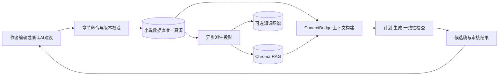

# Nai 架构准则

## 1. 产品边界

Nai 是作者主导的长篇小说创作工具。作者保存的小说、章节、角色与设定是事实；AI 负责提出草稿、分析和修改建议，不应把未确认的候选内容直接写成正式事实。

系统遵循四条基础原则：

1. **关系数据库是唯一真源**：正文、章节编号、版本和结构化设定以数据库记录为准。
2. **派生数据可重建**：RAG、图谱、缓存和统计都由真源生成，失败不能破坏正文保存。
3. **AI 操作可审阅**：生成和优化返回结果或差异，由作者决定是否应用。
4. **能力必须诚实**：未实现功能明确返回不可用，不允许用固定分数或占位文本伪装成功。

## 2. 核心数据流

章节保存只负责版本校验和数据库提交。向量索引、一致性分析和编辑审核不得阻塞自动保存，也不得在候选稿检查阶段污染正式时间线。

## 3. 小说领域边界

- `Novel` 是作品聚合根。
- `Chapter` 使用 `(novel_id, chapter_number)` 唯一约束和递增 `version`。
- 章节列表只返回摘要；正文通过详情接口按需加载。
- 下一章编号由服务端分配，客户端不能根据局部分页结果推算。
- 角色、世界观事实、剧情事件和大纲应逐步收敛到结构化 Story Bible；`Novel.worldview` 只作为兼容文本或可重建投影，不应长期承载全部领域数据。

Story Bible 已落地第一阶段：`StoryFact`/`StoryEvent` 经 Alembic 迁移建表，`/api/story-bible` 提供 facts/events 的 CRUD 路由；写入模型带显式预算，所有端点先校验小说所有权。角色已有独立管理；世界观、地点、大纲等历史 Schema 骨架仍未接入路由，继续启用前必须先确定唯一事实模型、补齐写入预算和租户边界，不能直接把这些骨架暴露成 API。

## 4. AI 上下文预算

所有 AI 调用都必须经过统一预算，不允许由组件任意拼接全文：

- 请求模型限制正文、提示、世界观、剧情指令和目标输出长度。
- RAG 先按小说和章节范围过滤，再做 top-k 召回。
- 前章使用摘要或有限尾部，不重复向多个 Agent 发送无限全文。
- 工作流 trace 只保存长度、短预览和摘要哈希，不回传完整 Prompt 副本。
- 重试次数、并发量、超时和模型输出都必须有上限。

## 5. 保存与并发

- 前端自动保存和手动保存共用同一个 latest-only 串行协调器。
- 每次保存携带 `expected_version`；服务端版本不匹配返回 409，旧请求不能覆盖新正文。
- 保存成功回调必须包含实际保存快照和新版本，不能只更新时间。
- 派生索引任务必须幂等。当前本地版使用响应后的异步投影；生产部署应升级为数据库 outbox，使任务在重启后仍能恢复。

## 6. 运行基线

当前受支持的本地基线：

- FastAPI + SQLAlchemy
- SQLite
- Chroma
- OpenAI 兼容模型接口：LM Studio 本地模型或 DeepSeek 远程模型
- Next.js + React + MUI

本地模型关闭时，正文与小说管理仍然可用；生成模型可独立切换到远程兼容接口。Embedding 与生成模型是两条独立链路，远程聊天模型可用并不代表本地向量服务可用。

PostgreSQL、Qdrant、Redis 和 Neo4j 只能在对应代码路径、迁移和验收测试完成后列为正式能力。Docker Compose 中出现一个服务，不等于应用已经使用该服务。

## 7. 演进顺序

1. 保证章节保存、版本、分页和恢复正确。
2. 建立结构化 Story Bible 和章节版本历史。
3. 将本地异步投影升级为持久 outbox。
4. 多用户部署前整体迁移 PostgreSQL，并把租户隔离下沉到数据库 RLS；应用层所有权过滤只作为第一道边界。
5. 在真实数据量下验证后，再决定是否从 Chroma 整体迁移 Qdrant。
6. 最后增加更多专项 Agent；默认链路保持简单、可解释、可取消。
