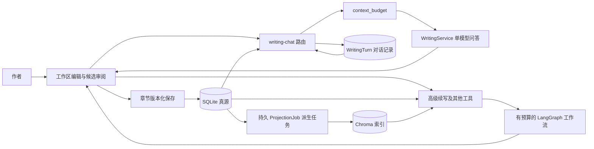

# Nai 架构准则与当前实现

Nai 是作者主导的长篇小说创作工具。本文区分当前代码与目标架构；具体缺口见 [底层架构评审](docs/design/底层架构评审.md)，模块契约/表约束/迁移见 [架构实施蓝图](docs/design/架构实施蓝图.md)，用户确定的四层方案见 [记忆分层设计](docs/design/记忆分层设计.md)。

## 1. 四条原则

1. **关系数据库是唯一真源**：作者正文、章节版本、正式设定和交流记录保存在数据库中。
2. **派生数据可重建**：RAG、自动摘要、状态投影和统计来自可追溯来源，失败不得破坏正文保存。
3. **AI 操作可审阅**：生成和优化先产生候选，作者决定是否应用；候选不自动变成事实。
4. **能力必须诚实**：未实现或失败明确报告，不用固定分数、占位文本或展示动画冒充能力。

第 3 条是目标约束。当前对话续写与局部改写已经遵循，但旧 `/api/generation/auto-chapter` 会生成并直接创建章节，是需要迁移的例外。

## 2. 当前数据流

图中两条 AI 路径已共用模型客户端工厂和 ModelResult 输出校验，并共用正式设定与有效 L1 的 ContextPack；任务编排与高级 RAG 路径仍不同。常驻对话由带受权只读工具的 Agent 运行时驱动：模型可经 `agent_tools` 按关键词/章节查阅账本事实、角色卡、有效简介、大纲与 RAG 前文，并可在交稿前调用一致性自查；所有检索重新核对作者归属与生命周期，目标章之后不可见，工具结果标注为资料数据。高级续写的多阶段链保持独立，工具候选不自动写入对话历史。Chroma 是派生索引，不是真源，Neo4j 等可选模块不作为当前核心流程的前置依赖。

## 3. 领域与持久化边界

- `Novel` 是作品聚合根，`Chapter` 有 `(novel_id, chapter_number)` 唯一约束及递增 `version`。
- Chapter 保存当前正文；ChapterRevision 追加不可变版本快照，唯一键为章节生命周期 + 版本号。历史目前只读查看，没有一键恢复覆盖功能。
- `Novel.worldview` 当前是作者直接编辑的正式设定文本，不能当作可删除的派生缓存。
- `StoryFact` / `StoryEvent` 已有表、权限隔离及 CRUD，生成时按目标章节读取当时有效的事实（包括后来退役的已知区间事实），事件只取已发生记录。角色已有独立管理；结构化大纲与人物/物品状态已接通，地点模型仍待演进。
- `WritingTurn` 按小说存问题、回复、模式、来源章节、正文哈希及状态。删除小说经 ORM 同步清理对话、事实、事件、角色关系与出场等附属数据。
- 当前应用连接设置 SQLite WAL 和 5 秒 busy timeout；没有开启数据库级外键强制检查。ORM 级联不能替代所有原生 SQL 写入的约束。

## 4. 工作区、对话与保存

前端桌面布局为活动栏、章节目录、中央正文/设定标签、常驻右侧对话和底部状态。窄屏上下分区。`WritingChat` 以小说为生命周期，切章、切换右栏和设定不会重置对话。

对话 UUID 在同一本小说内唯一。服务端先保存问题为 `pending`，再调用模型；失败与取消有持久终态，迟到响应不能覆盖。回复通过 HTTP 完整返回，前端可轮询历史恢复状态。停止不保证终止上游计算；服务重启后不自动续跑，过期 pending 在读取历史时标为失败。

续写采纳前比较章节与正文哈希；局部改写校验来源章节、原文和范围。采纳进入现有编辑器撤销和保存流程，并由 WritingAdoption 持久记录候选、来源版本和采纳后的正文版本。

自动与手动保存共用 `useChapterSave` 的 latest-only 串行协调器；每次带 `expected_version`，冲突返回 409 并进入版本对比。离线保护覆盖已加载章节，尚不支持完全离线冷启动。

## 5. 上下文与四层记忆

现行 `context_budget.py` 统一限制模型输入。对话最多查询最近 20 个完成轮次，历史总预算 8000 字符；另对世界观、事实/事件、正文及当前指令设限。向量检索按小说和章节范围过滤，各工作流限制输入、输出、重试与超时。当前预算主要按字符计算，不宣称精确 token 计费。

目标记忆结构由用户确定：

1. **L0 原文**：正文版本与交流证据分域保存。
2. **L1 提取简介**：按章/场景概括发生经过，能回查原文。
3. **L2 结构化大纲**：卷章场景、因果、伏笔，计划与实际分开。
4. **L3 高频核心状态**：世界规则、人物、主角物品等，按章节/场景生效。

L0 版本、L1 简介、L2 计划/实际大纲与 L3 人物/物品状态已实现当前范围的有界召回；跨全书语义召回仍待演进。高层数据必须保留来源，原文修订能使相关派生记忆失效；人工设定不能被模型自动覆盖，未来计划不能当成当前事实。细节见 [记忆分层设计](docs/design/记忆分层设计.md)。

## 6. 运行与演进

当前支持 FastAPI + SQLAlchemy + SQLite、Chroma、OpenAI 兼容模型接口，以及 Next.js + React + MUI。生成模型与 Embedding 独立配置；关闭模型仍可管理正文。

推荐保持模块化单体：路由负责鉴权和协议，应用服务负责对话/工具编排，领域命令负责版本与确认，模型客户端和索引作为适配器。已抽出 WritingService，并统一模型客户端配置和完成性检查；已共享正式设定与有效前章简介的 ContextPack；任务路由、其余四层数据与统一候选仍待演进。

章节简介使用 `derived_jobs` 事务任务及进程内串行 worker，具备 CAS 领取/发布、租约恢复与有限重试。RAG 索引使用持久 `ProjectionJob`，具备租约恢复、版本栅栏、重试和查询；与简介任务分开计量。

PostgreSQL、Qdrant、Redis、Neo4j 需要在真实并发/规模和部署需求出现时再评估。迁移数据库需验证全量迁移、回滚与租户隔离，不能把 Compose 服务定义当作已经接入。

## 7. 模型调用与结果边界

`model_provider.py` 集中构造文本模型客户端，使用统一连接、超时、网络重试与输出 token 上限，各业务保留温度和模型选择。`model_result.py` 拒绝截断、过滤、工具调用和非空文本契约之外的响应；不把半段输出作为完成候选。模型返回的 model/usage/finish_reason 可选，缺失不估算。字符预算不等于 token 计费。

创作对话的消息预算及调用移入 `WritingService`，路由保留鉴权、历史和 pending 终态原子更新。截断及格式异常记为 failed，模型超时有独立文案。六维审核与轻量编辑在传输完成校验后再执行严格业务 Schema；其他 JSON 能力仍有专用结构校验待办。

生成和独立一致性请求的故事日默认 null。未知日期时不做按日验证，章节范围仍有效；无法定位章节的事件只有在目标故事日明确且不晚于该日时才能纳入有章节上限的召回。此规则不修改数据库中作者维护的事件。

## 8. 原文与简介的事务闭环

`crud/novel.py` 的建章、自动分配建章和保存入口在唯一 commit 前调用 `services/chapter_memory.record_chapter_save`。该服务只 flush：追加原文快照、使旧简介 stale、将旧 queued/running 任务置为 superseded，并为非空新稿入队。任一步失败整体回滚，版本冲突不新增任务。暂不另设重复的 ChapterCommands 外壳；跨聚合事务与候选采纳审计仍按后续阶段演进。

`DigestExtractor` 对固定原文执行严格 JSON 提取，整章最多 20000 Unicode 字符，超限明确失败；不裁掉前半章冒充完整简介。服务端核验引用起止、原句、来源版本与 SHA-256，引用存在不等于模型概括已经通过事实质量评测。人物/物品变化仅为候选。

`MemoryWorker` 在模型调用期间关闭 Session；发布先以任务状态/租约 CAS 获取写事务，再核对作品/章节生命周期、版本、标题、章号与正文哈希。同事务写简介和成功终态。重试为至少一次执行，可能重复模型请求，不承诺恰好计费一次。失效积压处理会主动让出事件循环。

启动时 `MEMORY_WORKER_ENABLED` 默认 false，保存仍保留任务；显式开启后执行积压任务。正常关闭取消运行协程，running 租约由下次启动在到期后回收。界面区分 ready/stale/missing 及任务状态，历史只读；有效前章 L1 已进入常驻对话和高级续写的共享上下文。

## 9. 共享 L1 上下文与生成时来源

`context_builder.build_context_pack` 接受服务端确定的作者、小说生命周期、目标章和可选故事日，加载有界世界观、目标章有效的 Story Bible、严格早于目标章的有效简介。L1 仅选当前原文版本、当前配方且 ready 的记录；读取时再次核对作品/章节身份、标题、章号、正文 SHA-256 以及逐字引用。实际最多使用最近 3 章、每章简介 700 字符、简介上下文总计 2400 字符；候选扫描窗口最多 50 条，额外记录未扫描范围。

简介以“自动提取参考”独立注入，不把 state_change_candidates、未解线索列表晋升为确认事实。只有 L1 存储不可用才在保存点隔离后降级，警告说明未使用简介；作者身份/生命周期错误必须阻断调用，不能降级为无界检索。构建结束复核身份，高级 RAG 完成后再复核，避免删除重建期间混书。

ContextPack 的 manifest 包含 scope、实际注入的 L1/L2/L3 sources、中文 warnings、省略计数、`memory_head_version` 及 fingerprint。指纹绑定共享包的实际文本和来源，不是完整模型请求或费用标识；sources 仍不覆盖全部历史问答和所有 RAG 中间片段。

对话在请求落库前冻结 manifest，并随 WritingTurn 持久保存。重复 request_id 返回原来源，后续改稿不改写旧轮清单；旧轮次为 null，不能从当前简介伪造历史。模型返回或候选落库前复核 `memory_head_version`，结构化记忆发生变化就拒绝旧候选。高级生成在 A/B/C 独立变量注入同一简介文本，普通响应、SSE 和工作流追踪透传同一 manifest。前端只读查看来源原文，不把链接当作当前版本或恢复命令。

这是按章就近召回并带 L2/L3 有界状态的当前实现；按人物/关键词检索全书、跨层下钻和原文内容的可信性自动证明仍未实现。现有历史交流仍属于候选上下文；L1 范围过滤不等于所有来源都已具备统一的叙事时点协议。

## 10. 检索实现的当前边界

`rag_service.hybrid_search` 目前是**向量检索 + 元数据过滤**(按 `novel_id`、`_owner_id`、
`_novel_lifecycle`、`max_chapter`),返回的 `retrieval_method` 即 `vector_metadata`;
**没有 BM25 或关键词分支**。`schemas.py` 里 `retrieval_method` 枚举中的 `bm25`
只是取值定义,不代表已实现 —— 对外描述能力时应按实现口径说明。

向量库为 Chroma(`chromadb.PersistentClient` + llama_index `ChromaVectorStore`),
其本身不提供 BM25,这是"hybrid"名不副实的根因。若后续补关键词分支,注意中文的两个坑:
SQLite FTS5 的 `trigram`/`unicode61` 分词器对**两个汉字**的查询是 0 命中,
必须在**写入时**把中文预分词为汉字 bigram,查询端无法补救;融合排序则应引入独立 BM25 实现,
不要指望向量库自带。
