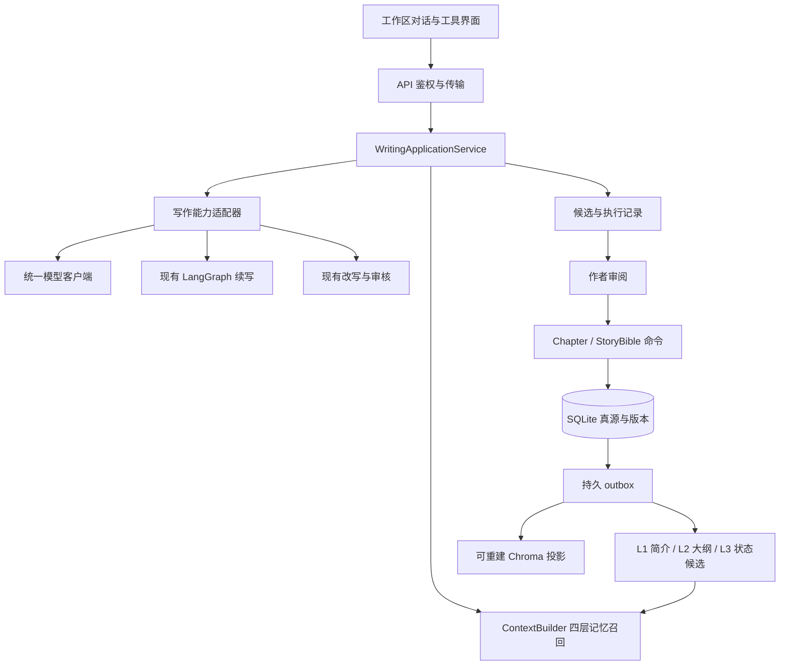

# 墨枢 底层架构评审与演进方案

日期：2026-09-08。范围：当前未提交工作区中的保存、持久对话、生成工具、记忆与投影。结论：继续采用模块化单体，优先打通对话、工具和四层记忆；现阶段没有证据表明更换技术栈或增加微服务能解决主要问题。

AI 能力专项复审见 [AI 应用架构评审](AI应用架构评审.md)，补充真实 Prompt 渲染缺陷、首章检索边界、固定三阶段工作流与质量/成本评测问题。

## 1. 已确认并修复的数据问题

**小说删除遗漏事实与事件，可能导致复用主键串书。**

证据：[Novel 模型](backend/app/models/novel.py)、[delete_novel](backend/app/crud/novel.py)、[数据库连接配置](backend/app/db/base.py)。修复前 Novel 缺少 StoryFact/StoryEvent 的级联关系，SQLite 连接又没有强制外键检查。

隔离内存库复现：旧小说 ID 为 1；删除后另一作者的新小说获得 ID 1，按新小说 ID 查询仍得到 1 条旧事实及 1 条旧事件。该验证没有读取或修改作者正文。

本轮已补 ORM `all, delete-orphan` 关系，并在 [test_story_bible.py](backend/tests/test_story_bible.py) 验证 active/retired 事实、planned/occurred 事件均被删除，其他小说记录保留，另一作者复用 ID 后 API 返回空账本。

该修复无需改表，覆盖应用 ORM 删除路径；不自动删除历史孤儿，不覆盖原生 SQL 的绕过路径。本轮只读检查默认本机数据库，事实与事件孤儿数均为 0；该检查不能识别已经被复用主键重新关联的历史记录。数据库级外键加固应在检查旧数据、迁移约束和删除顺序后单独实施。

## 2. 主要结构缺口

| 优先级 | 问题与触发场景 | 代码依据 | 实际影响 |
|---|---|---|---|
| P1 | 常驻对话要求高级续写或改写 | [writing_chat.py](backend/app/api/routes/writing_chat.py)、[generation.py](backend/app/api/routes/generation.py) | 主对话单模型，不能统一调用既有工具；高级工具结果未进入对话历史 |
| P1 | 长篇创作依赖较早剧情与人物状态 | [context_budget.py](backend/app/services/context_budget.py)、[WritingTurn](backend/app/models/writing_chat.py) | 持久历史只有有限片段进入模型，没有四层提取、来源依赖或按章物品状态 |
| P1 | 需要追踪某个建议是否已经应用 | [WritingChat.tsx](frontend/components/workspace/WritingChat.tsx)、[writingChat.ts](frontend/lib/writingChat.ts) | 前端快照能防旧候选覆盖，但没有服务端候选→采纳→正文版本关系；auto-chapter 还直接创建正文 |
| P1 | 生成或索引过程中进程退出 | [writing_chat.py](backend/app/api/routes/writing_chat.py)、[novels.py](backend/app/api/routes/novels.py) | 生成绑定 HTTP，索引绑定 BackgroundTasks；不能重启续跑，对话依靠后续 GET 过期收敛 |
| P2 | 调整模型超时、重试或提示词 | [agent_service.py](backend/app/services/agent_service.py)、[generation.py](backend/app/api/routes/generation.py) | 多处构造 ChatOpenAI，普通/流式续写重复构建上下文，容易配置漂移 |
| P2 | 增加工作区功能或调整会话状态 | [workspace/page.tsx](frontend/app/workspace/page.tsx) | 页面同时管理导航、保存、对话、设定和弹窗，跨状态改动难以局部验证 |

这些是可演进的边界缺口，不意味着现有保存、权限和候选保护全部无效。先保留已验证的协议，沿调用边界抽取模块。

## 3. 目标模块边界（待实现）

- **路由层**：身份、资源所有权、请求校验、HTTP/SSE 协议；不从其他路由导入全局模型。
- **应用服务**：同一轮对话的状态、能力选择、上下文、结果与取消。先使用显式讨论/续写模式和有限工具，之后再评估自主工具选择。
- **能力适配器**：复用既有续写、改写和分析，统一有界输入及类型化输出。读取/分析与写正文命令分开，模型不直接获得任意数据库写权限。
- **领域命令**：保留 `expected_version` 校验，将候选采纳记录和正文写入放在同一事务；撤销采纳通过新版本表达，不抹掉审计历史。
- **模型/存储适配器**：统一客户端配置及超时；Chroma 等只持有派生数据。
- **任务处理**：同事务记录提取/索引任务，执行与 HTTP 连接分离。失败、取消和过期版本不能被迟到成功覆盖。

## 4. 四层记忆如何进入架构

按用户确认的原文→提取简介→结构化大纲→高频设定/主角物品四层实现。完整数据契约、版本失效规则和物品案例见 [记忆分层设计](记忆分层设计.md)。

关键前置依赖是原文版本与可恢复提取任务。不能只在提示词中分四个标题就称为四层记忆，也不能把 DSH 的外部用户画像目录当成网页端的小说事实库。

正文版本留证据；自动简介与实际剧情结构可重建；手写大纲/设定保留为作者数据。提取出的物品与人物变化先确认，按目标章节查询状态，避免未来剧情泄漏和旧物品归属污染。

## 5. 分阶段实施与验收

| 阶段 | 具体改动 | 验收标准 |
|---|---|---|
| A：统一调用边界 | 抽取模型工厂和创作应用服务，普通/流式生成复用上下文构建 | 路由不互相依赖；现有幂等、权限、取消和保存测试保持通过 |
| B：L0/L1 基础 | 章节版本、出处、同事务任务、按章简介 | 改稿后旧简介退出召回；重启可处理积压任务；模型失败不阻塞保存 |
| C：L2/L3 记忆 | 计划/实际大纲、按章设定与物品状态、来源核对 | 物品转交/丢失不重复记账；回写旧章不注入未来状态；不覆盖手工计划 |
| D：统一工具与采纳 | 对话调用高级续写/改写，持久工具结果与候选采纳关系，迁移 auto-chapter | 候选只能应用到匹配版本；重复采纳幂等；拒绝的内容不提升为事实 |
| E：真实模型评测 | 固定长篇样例和来源追溯检查，记录延迟与资源消耗 | 能复现改稿、跨章伏笔、状态变化；效果与预算有可比较基线 |

A 起建立小评测样例，E 扩大覆盖。每阶段先保持现有 UI/API 可用，新增表通过 Alembic；废弃旧接口时明确迁移步骤。四层首次构建从原文回填，模型提炼仅作为派生结果或候选，不批量覆盖作者设定。

## 6. 全链路复审范围

本轮在前次评审基础上完成后端模块/依赖清点（53 个 Python 文件、13 个路由模块、11 个服务模块），并按下列实际链路深读关键实现。全量测试覆盖面不等于每条模型路径和每种生产竞态都已验证。

| 边界 | 检查内容与结论 |
|---|---|
| 认证/所有权 | JWT 校验、用户状态、小说/章节/角色、Story Bible、RAG 和 MCP 的权限入口；现有隔离测试通过。鉴权较分散，长任务必须携带原始授权作用域，不能仅凭 novel_id 在等待后重新推导作品身份 |
| 数据库/迁移 | 基线迁移、旧库兼容、模型注册、版本更新与级联删除；SQLite 主键复用需要生命周期保护。修复角色附属记录清理；外键强制、NULL/生效区间约束、跨数据库迁移仍需专项加固 |
| 正文写入 | 服务端分配章号、版本条件更新、分页摘要、导出和后台索引；章节 CRUD 在同一次 commit 前落原文版本与简介任务，任务插入失败整体回滚 |
| 对话/模型 | 先落库、幂等、有限历史、输入输出预算、取消和迟到结果；修复停止竞争。模型配置仍散布在多个服务，主对话与工具未统一 |
| 记忆/事实 | 事实与事件筛选、简介与大纲骨架、来源语义；修复历史事实与计划事件混用。完整 L0–L3 提取/召回待实施 |
| RAG/投影 | Chroma 延迟初始化、作者/生命周期/版本过滤、异步更新和清理；保留已有防乱序逻辑。没有持久 outbox，不承诺崩溃恢复；检索失败与确无结果的诊断区分仍不足 |
| 一致性/审核 | 规则、时间线、图谱、情绪跳过状态与六维严格输出校验、并发上限；修复无参考数据仍报告已检查。数据库参考尚未接通，不能宣称已验证全书事实 |
| 前端保存/会话 | 串行保存、导航守卫、冲突、离线备份、候选 hash 校验与历史恢复；修复旧回包清掉新备份。客户端来源身份和服务端采纳审计仍需补齐 |
| MCP/插件 | 能力矩阵、角色操作、审计、插件 token 与版本化保存契约；DSH 记忆为独立运行时，不能冒充网页四层系统。真实 DSH/腾讯底层运行未在本轮启动验收 |
| 启动/部署/观测 | 环境配置、依赖、日志和 Compose；现有 Compose 仅为可选基础设施，不是经过验证的 墨枢 生产部署。无跨进程任务恢复、统一执行关联 ID 与完整模型质量基线 |

模块依赖清点保存在忽略入库的 `.Codex/architecture-module-inventory.json`；公开结论不依赖该本地文件才能理解。

## 7. 本轮已修复的六类缺陷

| 问题 | 触发条件与原行为 | 修复与验证 |
|---|---|---|
| 历史事实被错误排除 | 第 12 章退役的“持有宝剑”，回写第 8 章也拿不到 | 按确立/失效章节查询，失效章起排除；验证 2/3/11/12/20 章及无目标章节 |
| 计划被当作事实 | planned 事件章号在当前章以前时，进入“已确认”上下文 | 查询只取 occurred，格式化再次过滤；计划仍保留在账本，未来规划需要独立计划上下文 |
| 角色附属数据残留 | ORM 删除小说、章节或角色，出场/关系仍存在 | 补 Novel/Chapter/Character 的级联关系，移除单一路径的手工重复清理；三条删除路径及其他作品保留均验证 |
| 停止覆盖已完成回复 | stop 读到 pending 后，执行器完成；旧 stop 随后改为 cancelled | 条件更新只允许 pending→cancelled；确定性制造旧读取快照验证完成回复保留 |
| 新稿备份被旧保存清除 | 保存 A 时继续写 B，B 已备份；A 成功清备份，B 保存失败 | 仅在编辑器与已保存快照相同时清理，否则立即备份新稿及新基线版本；测试验证失败后 B 仍存在 |
| 空参考伪装检查通过 | 没有加载规则或时间线仍标 completed/ok | 返回 skipped、is_valid=null 和原因，HTTP/SSE/trace 一致；真实存在参考的违规检查仍有效 |

前五类新回归在修复前均复现失败；一致性参考缺失通过服务与 SSE 回归核验。上述改动不改变表结构，没有对作者数据库执行清理或迁移。本机默认库只读检查，角色关系/出场孤儿数均为 0；不能据此反推所有历史记录来源都正确。

## 8. 尚未修复、进入架构实施的重点

### R1 · P1：高级续写固定故事日为 1，丢掉后续事件

证据：`generation.py` 的普通续写、流式续写等构造 `GenerationRequest(current_day=1)`；`agent_service.py` 再按这个值查询事件；`get_events_for_generation` 使用 `story_day <= current_day`。例如第 20 章的故事已到第 8 天，高级续写仍会滤掉第 2 天以后的已发生事件，而主对话没有同样的日过滤，两条链路上下文不一致。

处理：共享 ContextBuilder 接收明确叙事位置；未知故事日不能默认为“第一天”。章内倒叙与故事日分开表达。验收覆盖第 20 章/第 8 天、未知日以及回改旧章，普通/流式调用使用相同上下文。

### R2 · P1：一致性参考只在内存，未从正式账本构建

证据：`ConsistencyService` 创建独立 `rules_by_novel` 与 `timelines`；应用业务写入路径未调用 `init_worldview_rules` / `add_event` 从 Story Bible 建立参考。当前修复让缺参考时诚实跳过，但尚不能自动根据作者设定检查候选。

处理：把适用事实与已发生事件作为一次检查的显式输入，不长期维护另一套正式内存事实库；状态检查与 L3 同源。只把明确可执行的规则编译为验证器，自由文本规则交给模型分析并保留不确定性。新增测试必须先经真实 CRUD 保存设定再验证，不能只手工给内存 fixture 加规则。

### R3 · P1：浏览器草稿和对话候选未绑定完整生命周期

证据：`useChapterSave.ts` 的草稿键/内容仅含 novelId 和 chapterId，恢复时缺少作者与不可复用来源身份；`ChapterResponse` 尚未返回生命周期字段。旧稿残留、同一浏览器切账号、删除再建并复用 ID 时存在误关联边界。新建章 `updated_at` 缺失时恢复判定直接允许旧草稿，时间比较不足以证明来源。WritingTurn 来源同样仅以 chapter_id/正文哈希表示。

处理：M0/M1 将作品/章节 lifecycle 暴露到受权 DTO，并贯穿备份、对话来源与采纳校验；旧草稿无法可靠匹配时只作为可导出恢复候选，不静默清除或自动应用。该项为代码路径审查结论，尚未新增跨账号完整 UI 复现；应在多用户使用前补专项回归。

### R4 · P1：没有原文版本和可恢复任务，无法保证记忆失效闭环

初次评审证据：章节仅有最新正文和 version，生成在 HTTP 中等待，RAG 使用 BackgroundTasks。M1 已新增不可变原文版本和可恢复简介任务，原文/任务同事务写入；RAG 持久恢复与其他生成任务执行仍待统一。

处理进展：revisions/jobs/digests 三表及事务边界已落地；每个任务带来源版本和 lease_token，原文变更后旧任务标 superseded。具体迁移与杀进程验收见实施蓝图。

### R5 · P1：对话、工具与候选确认未形成统一执行链

证据：`writing_chat.py` 从 `generation.py` 导入模型，单模型问答与 LangGraph 分离；采纳记录只在前端，旧 auto-chapter 直接创建章节。

处理：应用服务 + 能力适配器 + 候选确认命令；模型输出不能绕开作者审阅，采纳记录与正文新版本在同一事务。先统一显式能力，不急于增加任意自主 Agent。

### R6 · P2：运行与契约加固

- 多处 ChatOpenAI 配置、重复 prompt 组装和路由间导入，收敛到共享模型/上下文边界；部分尚未接通的世界观分析方法仍直接接受 context 字典，启用前必须补预算。
- async 路由使用同步 SQLAlchemy，锁等待与同步哈希会占用事件循环；在测得并发瓶颈后统一线程/异步数据库边界，避免把同一个 Session 随意跨线程传递。
- 异步检索/提取必须传播进入请求时的 actor/lifecycle scope，不能在等待后仅凭可复用 novel_id 重新认定授权；纳入删除重建与双作者竞态测试。
- 当前应用连接没有强制 SQLite 外键；Story Bible 某些更新字段允许显式 null、生效区间缺跨字段约束。需要先补 schema/领域验证和旧数据预检，再添加数据库约束。
- 真实模型输出质量、提取预算、端到端取消资源释放、PostgreSQL 迁移与真实 DSH 插件均未被本轮模拟测试证明。

这些项目需要跨模块契约或迁移，未在本次 review 中做未经验证的大范围替换；已转成 [架构实施蓝图](架构实施蓝图.md) 中的步骤与验收门槛。

## 9. 验证结果

后端全量 **211 通过、2 跳过**（真实服务集成），覆盖率 71%；前端 **17 文件、60 项通过**，lint、typecheck 与生产 build 均通过。当前没有提交、推送、部署或作者数据库结构变更。

结论是完成本轮架构审查与实施准备，现有确定性缺陷已按上表修复；不是宣称四层记忆、全部时态问题、多用户边界或生产可用性已经完成。
