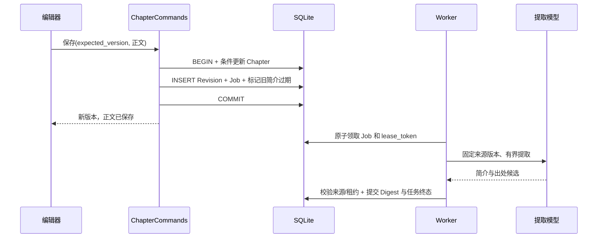
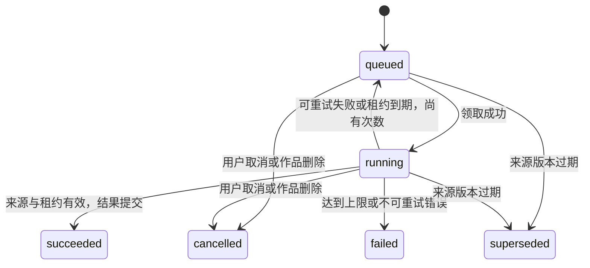

# 墨枢 四层记忆架构实施蓝图

更新：2026-09-08。状态：M0 模型工厂、输出契约与对话服务已落地，M1 原文版本/任务/简介及只读界面已实现并通过本地自动化验证，真实模型验收待执行；各项完成证据统一见 [实施监督](../plan/实施监督.md)。下文未特别标明已完成的内容仍为设计目标。现有链路确定性缺陷详见 [底层架构评审](底层架构评审.md)。产品层定义见 [记忆分层设计](记忆分层设计.md)。

模型编排、任务路由、ContextPack、输出/成本契约与质量评测的专项结论见 [AI 应用架构评审](AI应用架构评审.md)。M0 需同步落实模型结束原因、Prompt 数据边界和专用任务契约。

## 1. 决策基线

| 决策 | 选择 | 原因 |
|---|---|---|
| 运行架构 | 保留 FastAPI 模块化单体、SQLite 与 Chroma | 当前主要缺口是数据/调用边界；不以微服务增加事务难度 |
| 四层定义 | L0 原文 → L1 简介 → L2 结构化大纲 → L3 核心设定/人物/物品状态 | 与用户写作流程保持一致 |
| 唯一真源 | 作者正文与确认后的领域记录在关系数据库 | 摘要、向量、自动大纲视图可重建；人工内容不能被当缓存删除 |
| 首个实施切片 | L0 版本 + 事务任务 + L1 简介 + 只读查看 | 构成可验收闭环，先解决改稿失效与恢复，再做复杂记忆 |
| 任务执行 | 数据库 outbox + 有界后台 worker | 先支持单机重启恢复；无需先引入 Redis/Celery |
| 模型编排 | 共享 ContextBuilder、模型客户端工厂与能力适配器 | 对话和高级工具使用同一事实与预算协议 |
| 事实晋升 | 提取结果先为候选，作者确认后才改变正式状态 | 防止 AI 讨论或误提取改变物品/剧情事实 |
| 自动更新 | 只重建自动派生部分；作者手写部分独立保留 | 避免重新提炼覆盖手写大纲与设定 |

## 2. 模块与依赖方向

以下为目标路径，相对 `backend/app/`。第一阶段只创建正在使用的模块，不一次生成空目录或占位服务。

```text
api/routes/                  请求校验、身份、协议适配
application/
  chapter_commands.py        保存/删除章节，事务及版本边界
  writing_service.py         对话与工具编排、执行和候选状态
  memory_service.py          简介查询、重建请求、来源检查
services/
  context_budget.py          复用现有统一预算
  context_builder.py         按任务选择 L0–L3，上下文及来源清单
  model_provider.py          模型配置、生命周期、调用超时
  memory/
    digest_extractor.py      L0 → L1 结构化提取
    outline_projector.py     后续 L1 → L2 实际剧情结构
    state_extractor.py       后续 L0 → L3 状态变更候选
  jobs/
    worker.py                领取、租约、执行、重试与发布
    handlers.py              明确注册的提取/索引处理器
crud/                        查询/变更，可加入上层事务
models/                      SQLAlchemy 和 Pydantic 契约
```

依赖仅从 API → application → 领域/查询/能力适配器 → 基础设施。`services` 不导入路由，路由不互相导入模型。鉴权来自 `api/dependencies.py`；下层接收已校验的显式作用域，而不是反向读取当前 HTTP 请求。

现有 `agent_service.py` 先作为高级续写适配器使用；不重写 LangGraph。`review_agent_service.py`、RAG 与角色服务逐步复用共享模型配置。前端继续使用已有保存协调器和 API 客户端，将工作区拆成组合视图、文档会话、创作会话，避免重建保存协议。

## 3. 关键接口契约（设计）

| 接口 | 输入 | 输出与约束 |
|---|---|---|
| `ChapterCommands.save` | actor、作品/章节身份、expected_version、标题与正文、幂等键（采纳场景） | 当前章/版本；同事务保存 revision 与 outbox；冲突不写任何派生任务 |
| `WritingService.start` | actor、scope、request_id、意图、编辑快照 | execution/turn；在生成前保存请求，禁止跨作品引用 |
| `ContextBuilder.build` | scope、目标位置、task_type、临时正文、预算配置 | messages、sources、omitted、warnings、context_fingerprint |
| `DigestExtractor.extract` | 固定原文 revision、schema/prompt/model 配方 | 严格验证的简介候选与 source_refs；不提交数据库 |
| `MemoryService.get_context` | scope、目标位置、实体、关键词 | 仅适用/有效的四层记录，返回缺失或过期状态 |
| `ProposalCommands.apply` | actor、proposal_id、目标身份、expected_version、当前内容哈希、幂等键 | 正文新版本和采纳记录原子提交；重复请求返回已提交结果 |
| `JobHandler.run` | job_id、lease_token、固定来源版本 | 成功产物或分类错误；发布前检查租约和来源仍有效 |

`scope` 至少携带 `actor_id, novel_id, novel_lifecycle_id`；正文来源另带 `chapter_id, chapter_lifecycle_id, revision_id`。沿用当前不可复用的 `rag_lifecycle_id` 作为生命周期身份，在服务 DTO 中使用通用名称，首阶段不强制重命名旧列。

每次读取、确认和任务发布均重新核对作用域。模型生成的 ID、出处与章节号不可信，必须查数据库验证归属和版本，不能让模型任意引用另一本小说。

## 4. M1 数据表：先做最小闭环

新增表名暂定，实际迁移以 Alembic revision 为准；现有 `WritingTurn` 和 Story Bible 表继续使用。

### chapter_revisions

| 字段 | 类型/规则 |
|---|---|
| `id` | UUID 字符串主键，永久唯一 |
| `novel_id, chapter_id` | 关联当前作品/章节；使用外键和聚合清理 |
| `novel_lifecycle_id, chapter_lifecycle_id` | 不可复用来源身份 |
| `version` | 与 Chapter 的递增版本一致 |
| `chapter_number, title, content` | 保存当次不可变快照，回看原文不依赖后续章号变化 |
| `content_hash` | UTF-8 SHA-256，与正文及来源引用一致 |
| `created_at` | UTC 时间 |

唯一约束：`(chapter_lifecycle_id, version)`。同一作品内源关联必须一致；模型层、写入服务与迁移检查共同保证，数据库复合外键可在明确唯一约束后落地。用户显式删除作品/章节时，遵循产品删除策略清理对应历史；“不可变”指保留期间不能覆写，不等于永远不允许删除。

### derived_jobs

| 字段 | 类型/规则 |
|---|---|
| `id` | UUID 主键 |
| `novel_id, novel_lifecycle_id` | 租户与作品范围 |
| `source_revision_id` | 引用不可变原文版本 |
| `kind` | M1 只启用 `chapter_digest`，后续增加 RAG/大纲/状态提取 |
| `recipe_version` | schema、prompt、模型配置的配方标识；不得包含密钥 |
| `state` | `queued/running/succeeded/failed/cancelled/superseded` |
| `attempts, max_attempts, available_at` | 有界重试与退避 |
| `lease_token, lease_until` | 防止旧 worker 迟到发布 |
| `error_code, error_message` | 分类与脱敏描述 |
| `created_at, updated_at` | UTC 时间 |

唯一约束：`(novel_lifecycle_id, source_revision_id, kind, recipe_version)`；索引覆盖 `(state, available_at, lease_until)`。同版本的多次“重建”复用任务；显式更换提取配方可以创建新任务。

### chapter_digests

| 字段 | 类型/规则 |
|---|---|
| `id, novel_id, chapter_id` | 记录身份与作用域 |
| `source_revision_id, recipe_version` | 对应来源与提取配方 |
| `summary` | 有上限的章节简介 |
| `participants, events, state_change_candidates, open_threads` | 有界且经 Pydantic 校验的 JSON |
| `source_refs` | 版本 ID、片段位置/引用文本哈希，服务端核对 |
| `status` | `ready/stale`；任务失败在 derived_jobs 中表达 |
| `created_at` | UTC 时间 |

唯一约束：`(source_revision_id, recipe_version)`。这些字段是自动派生产物，`state_change_candidates` 不能直接改变正式 StoryFact 或物品归属。作者手写简介如需支持，独立字段/记录，不放在自动覆盖区域。

## 5. M2/M3 表与现有模型衔接

| 新能力 | 复用/演进 | 不允许的双真源 |
|---|---|---|
| L2 规划大纲 | `outline_nodes` 的 author/planned 分支，卷章场景 parent 结构 | 自动重建覆盖作者计划 |
| L2 实际剧情结构 | 独立 derived/occurred 节点，关联来源 revision | 将“未来计划”写成已经发生 |
| 依赖传播 | `memory_dependencies` 记录产物→来源版本/产物 | 仅按更新时间猜哪些记忆过期 |
| L3 人物身份 | 复用 Character 主键与小说归属；名字只是可改标签 | 同名角色自动合并、跨小说同名关联 |
| L3 事实 | 逐步扩展 StoryFact 为有来源及生效区间的确认记录 | 新建 CoreState 后继续独立写两份正式事实 |
| L3 物品 | Item 实体 + 不可变变更记录（获得、转交、消耗、遗失） | 把“当前库存投影”当唯一历史真源 |
| 提取确认 | 候选记录与确认命令，确认后产生正式事实/物品事件 | 模型置信度或召回频次自动获得写入权 |

物品同名不自动视为同一件，单件与可堆叠物品分类型；转交在一个事务内表达来源与去向，幂等事件不能重复加减数量。事件存有效叙事位置及故事内时间，回写旧章按目标位置重放有效变化。

第一版按章边界使用半开区间 `[valid_from, valid_to)`，同章多个变化无法准确定位时显示待核对，不杜撰场景顺序。未来加入场景/段落锚点时保留原文 revision，不用易漂移的当前文本偏移单独指向历史。

## 6. 保存与任务事务



M1 实际实现保留现有 CRUD 的唯一 commit，拆出不提交事务的 `services/memory/chapter.py`，在正文 flush 后、commit 前追加 revision/job 并失效旧简介，避免在保存后补任务。所有当前章节写入入口均经此路径，删除沿 Chapter→Revision→Job/Digest 单链级联。未来跨聚合命令出现时再提升整体应用事务边界，不新增空的应用服务外壳。

初次建章也生成 revision；章节重命名/改章号会产生版本，新旧摘要视图依赖规则保持一致。未保存的编辑内容只传给本轮模型，不生成正式简介；候选采纳后才走该保存事务。

### 状态机



领取和发布都用数据库条件更新，不依靠进程内锁实现持久并发控制。模型调用期间释放事务。worker 重启后回收过期租约；旧 worker 即使恢复，也因 lease_token 不匹配无法发布。重试语义为至少一次执行、幂等发布，不承诺模型服务恰好调用一次或绝不重复计费。

并发数、超时、最大尝试与退避配置统一管理。取消首先保证数据终态；是否能中止上游计算取决于模型服务，不做无条件承诺。

## 7. API 与工作区交互（前四项已实现，确认命令待实施）

| 接口 | 行为 |
|---|---|
| `GET /api/novels/{id}/chapters/{chapter_id}/digest` | 最新来源对应简介及来源版本、ready/stale/missing、任务状态 |
| `POST /api/novels/{id}/chapters/{chapter_id}/digest/rebuild` | 202 返回任务；重复同来源/配方返回已有任务 |
| `GET /api/memory-jobs/{job_id}` | 验证作者/作品权限后返回任务状态与可展示错误 |
| `GET /api/novels/{id}/revisions/{revision_id}` | 按需读取受权的原文版本；不存在/越权统一 404 |
| `POST /api/novels/{id}/memory-candidates/{candidate_id}/confirm` | M3：核对来源版本、预期状态版本、幂等键，再确认领域变化 |

不要新增自动提炼就盖章“已确认”的 UI。工作区增加可展开的简介与来源区，展示“正文已保存，简介更新中/失败/过期”，正文输入不等待提取。错误可以重试，不清空旧稿。

ContextBuilder 返回 `sources` 和 `omitted` 支持“本次参考”展示；默认只显示作者关心的章节、设定与有效位置，模型/任务技术参数留在开发诊断。

浏览器离线草稿和对话候选后续使用服务端返回的作品/章节生命周期身份，不能只依赖可复用整数 ID。旧草稿不能可靠匹配时保留为可导出恢复候选，不自动覆盖新作品。

## 8. 迁移与回退

| 批次 | 操作 | 发布门槛 |
|---|---|---|
| M0 | 统一模型/应用服务入口与事务 seam，补当前缺陷 | 现有 API、所有权、取消、保存测试保持通过 |
| M1 | Alembic 新增 revisions/jobs/digests；回填每章当前版本；开启显式提取 | 旧正文逐字段不变；重复迁移/回填幂等；全量初始化与迁移测试 |
| M2 | 增加 outline_nodes/dependencies、计划与实际分域 | 重建不覆盖手写大纲；改稿依赖能失效 |
| M3 | 补 L3 来源、生效区间、实体与物品事件及确认命令 | 转交/遗失案例、历史时点、撤销、更名与重试均正确 |
| M4 | 接入共享召回、候选采纳审计与旧 auto-chapter 迁移 | 对话与高级工具上下文一致、拒绝跨版本采纳与重复写入 |

迁移前停止写入并备份；先在临时数据库跑升级/回退，不直接拿作者库调试。M1 回填只复制每章当前版本，不伪造不存在的历史版本；派生提取另由任务执行，迁移过程不调用模型。

回退先停 worker/停新写入口，再备份新增数据并退回兼容代码；需删除新表时显式导出历史版本与审计记录。四层数据不能依赖可随时丢弃的本地日志才能恢复。旧库 orphan、外键与重复数据预检输出定位报告，不自动删除不明归属数据。

## 9. 首阶段拆分与验收

1. **事务边界**：章节保存/创建/delete 使用可组合 CRUD。注入任务插入失败，验证正文更新一起回滚；409 不生成 revision/job。
2. **原文版本**：迁移与当前版本回填；版本不可改、不能跨作者读取；删除后同整数主键重建不继承旧版本。
3. **任务运行**：两个 worker 竞争同任务、超时重试、杀进程后回收、取消与迟到结果；结果幂等发布。
4. **L1 提取**：严格 schema、字符预算、出处核验与模型失败降级；原文修改后旧任务不能发布为最新简介。
5. **只读 UI**：查看简介、原文出处和任务状态；重建不中断编辑；跨章不会显示旧章简介。
6. **统一接入准备**：先让主对话读取有效 L1，返回有限来源清单，再接高级工具；保留没有简介时的明确降级。

至少保留四组固定模型样例：长篇跨章线索、未来计划误混、物品转交/丢失、改前文引起后续依赖冲突。程序测试证明协议与恢复，真实模型评测记录提取准确率/遗漏、来源正确率、延迟与 token 使用，不使用腾讯宣传指标代替本项目测量。

完成定义：使用一本有真实章节长度的作品，保存→简介更新→改稿失效→重建→断进程恢复→回查原文全链路可演示；未过此门槛，不标记四层记忆已完成。

## 10. M1 实施对照

实际模块：`models/memory.py`、`services/memory/chapter.py`、`services/memory/config.py`、`services/memory/digest.py`、`services/memory/worker.py`、`api/routes/chapter_memory.py`。前端为工具区 `ChapterMemory`。迁移版本 `a8d2e4f6b901`；旧库回填只生成已有当前原文的快照，不自动创建提取任务。新建或保存非空正文时才按当前配方排队，也可手动重建。

`ChapterDigest.source_refs` 当前是内嵌引用列表：revision_id/start/end/quote/content_hash/quote_hash。每份简介必须有至少一条经服务器核对的出处。participants/events/state_change_candidates/open_threads 为有界字符串列表；结构化实体、逐条断言和跨章依赖还未实现。配方包括显式 Prompt/Schema 版本、模型及预算，配方过期任务不会用新配置冒名发布。

数据库与模型替身测试覆盖保存→提取→改稿过期→新来源发布→历史回查，以及重启租约、竞争、错误回滚；真实模型和真实作品演示尚未执行。因此 M1 代码闭环已具备，不能据此把完整四层记忆或写作效果标为验收完成。有效 L1 的有界召回与固定质量样例已准备并接线；下一步执行真实质量验收，再扩 L2/L3。

## 11. 共享 L1 召回实施更新

`services/context/builder.py` 已供 WritingService 与高级 AgentService 共用；L1 来源范围、完整性核验和预算在此统一。当前 manifest 仅列实际进入模型的简介来源，fingerprint 是共享上下文身份，不等于完整执行审计。迁移 `b9e3f5a7c012` 为 writing_turns 增加可空 context_manifest，旧记录不回填，普通/SSE 高级生成响应也包含该字段。

任务选择、实体检索、L2/L3、跨章依赖以及采纳审计仍为目标。评测样例属于原创合成基线，未执行真实模型测量，不取代前文的作品级验收门槛。
