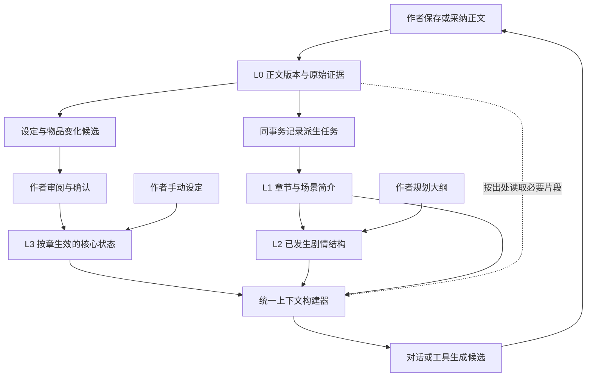

# 墨枢 四层记忆设计

状态：2026-09-13，L0-L3 当前范围及共享召回已实现并本地验证；本次补充记忆快照版本栅栏，防止模型等待期间使用已过期的 L2/L3。跨全书语义召回与作者盲评仍是后续工作。用户确定的层次为原文、提取简介、结构化大纲、高频设定与主角物品。本文用 L0–L3 对应第 1–4 层，避免与参考方案编号混淆。

模块契约、首批表结构、任务状态机和迁移拆分见 [架构实施蓝图](架构实施蓝图.md)。

## 1. 四层含义

| 用户层次 | 编号 | 保存什么 | 主要用途 | 当前基础 |
|---|---|---|---|---|
| 第一层：原文 | L0 | 正式章节原文与版本；对话原文单独标记来源 | 最终证据，核对细节和重建记忆 | `Chapter` 当前稿、`WritingTurn` 对话、`ChapterRevision` 不可变原文版本已实现 |
| 第二层：提取简介 | L1 | 每章/场景简述：发生了什么、涉及谁、时间地点、变化与未决线索 | 用较小上下文了解前情、定位原文 | `ChapterDigest` 与持久任务、出处核验、过期标记已实现；有效前章简介已按预算接入生成 |
| 第三层：结构化大纲 | L2 | 卷→章→场景、冲突、因果、转折、伏笔与回收关系 | 把握整体结构、选择相关章节 | `StoryOutlineNode` 计划/实际分域、来源核验和有界召回已接通 |
| 第四层：高频核心记忆 | L3 | 世界规则、主要人物属性、当前目标/位置/关系、物品归属与数量状态 | 每次写作优先参考的紧凑状态包 | 稳定实体、状态候选、确认/拒绝/撤销、按章生效和来源阻断已接通 |

L0 完整保存，默认只向模型提供当前正文的必要片段。L1 概括发生经过，L2 组织结构，L3 提供当前写作所需状态。第四层是“高频优先”，仍需预算，不能随着全书增长无限塞入模型。

## 2. 参考腾讯方案的范围

已核对官方 [TencentDB Agent Memory README](https://github.com/TencentCloud/TencentDB-Agent-Memory/blob/main/README.md)：长期记忆为 L0 Conversation → L1 Atom → L2 Scenario → L3 Persona；强调渐进披露、异构存储和从高层返回原文证据。

对应到 墨枢：原始对话扩展为正文证据；原子信息提炼进章节简介及状态候选；场景组织用于大纲；画像层改为小说核心设定和人物/物品状态。**这是小说领域的重新设计，并非腾讯现成支持了小说四层数据模型。**

[CloudBase OpenAgentKernel](https://github.com/TencentCloudBase/OpenAgentKernel) 的公开 README 另有 `userMemory`，用于同步用户记忆文件到 CloudBase Storage；该机制与上述语义四层不是同一个定义。本方案参考 TencentDB 的层次与追溯思想，不强制购买或接入腾讯云。

历史注记：仓库曾包含 DSH 插件包装 `dsh-nai-memory`，2026-10 已随插件层整体移除；它不能作为 墨枢 网页端已经具备四层记忆的证据。

## 3. 写入与召回方向

提取时从原文向上组织；使用时先定位核心设定与大纲，再按任务取简介和原文。L3 的精确数量、归属等必须能引用 L0 或作者直接录入的设定，不能仅依靠多次摘要后的推断。L2/L3 都允许作者主动编写，不强迫其全部由 AI 从下层生成。

## 4. 事实、计划和讨论分开

- **正式正文**：作者保存的章节是已发生叙事的证据。当前编辑器未保存稿可以作为本次请求的临时上下文，不能提前更新持久记忆。
- **作者设定**：手动确认的世界规则与人物状态有独立来源；可以在正文尚未涉及前存在。
- **未来计划**：规划大纲、计划事件、伏笔预期单独标记。需要谋篇时可召回，并明确“尚未发生”；不能直接写入当前物品状态。
- **AI 候选与讨论**：原文交流保留在 L0 对话域，生成的候选不等于被采纳。只有明确确认才能进入正式设定或正文来源。
- **冲突**：正文与作者设定互相矛盾时保留双方出处，显示待处理冲突。高频、最近召回次数和模型置信度都不能自动决定哪条是事实。

L1 可自动产生派生简介；L2 的实际剧情视图可自动重建。它们必须带来源、版本和派生标记，不得自动覆盖作者手写简介或规划大纲。AI 抽取的 L3 状态变化先进入待确认列表，后续再基于评测决定是否开放用户主动启用的自动确认规则。

## 5. 数据契约（L0-L3 当前范围已实现）

避免只做一张 `memory(text, embedding)` 表。复用当前领域模型，并增加最少的版本、引用和派生结构。

| 对象 | 建议关键字段 | 约束 |
|---|---|---|
| `ChapterRevision` | `novel_id, chapter_id, revision_id, version, content, content_hash` | 保留不可变来源快照；单调版本，不因删除重建复用身份 |
| `MemorySource` | `novel_id, source_kind, source_id, revision_id, start, end, quote_hash` | 引用章节版本、作者设定或交流记录；每次读取重新检查所属小说 |
| `ChapterDigest`（L1） | `chapter_id, source_revision_id, summary, participants, changes, open_threads, status` | 同版本任务幂等；自动简介与作者手写简介分字段或分记录 |
| `OutlineNode`（L2） | `parent_id, kind, chapter_id, plot_status, conflict, outcome, source_refs` | `planned/occurred` 分开；人工计划不被自动提炼覆盖 |
| `CoreState` / 状态变化记录（L3） | `entity_id, attribute, value, valid_from, valid_to, origin, source_refs, confirmation_status` | 按写作位置查询状态；保留修订历史与确认来源 |
| `ItemTransfer`（L3） | `item_id, from_owner, to_owner, quantity, effective_position, source_refs` | 获得/消耗/转交/丢失均为变化记录；不能仅覆盖“当前拥有”布尔值 |
| `MemoryJob` | `novel_id, source_revision_id, kind, extractor_version, state, attempts, lease_until` | 同事务 outbox，重试有界，过期执行结果不能发布为当前版本 |

`StoryFact` 继续承担作者事实，不复制出第二套正式事实源；迁移时把其映射到生效区间和出处。`Novel.worldview` 在迁移完成前仍是作者原始设定，不能降格为可删除缓存。

章节内可能有多次状态变化，生效位置最终需支持场景/段落锚点。第一版先支持章边界，并在同章改写时按当前光标/选区读取可用证据；无法定位的同章变化不当成已确认当前状态。另区分故事内时间和叙事顺序，倒叙场景不能只按 `story_day` 排序推算物品归属。

## 6. 改稿、删除与失效

1. 保存正文及版本时同事务追加记忆任务，正文保存不等待模型。
2. 后台提取使用固定的来源版本；完成前检查该版本仍是否为当前来源。
3. 新版本出现后，依赖旧版本的简介、实际大纲节点与 AI 派生状态标为过期。过期数据仍可审计，不作为当前事实注入。
4. 重新提取后根据依赖引用更新受影响内容。早期实现可以保守重算后续相关章节，不能仅刷新被编辑章节而留下后续错误状态。
5. 作者确认过的设定若来源被改动，标记“来源已变化，待核对”，保留作者记录；不得自动删除手工设定，也不得悄悄继续当作无争议事实。
6. 删除章节/小说同时使引用和任务失效。后续新建作品即使整数 ID 相同，也不能接受旧任务结果；沿用现有生命周期标识思想并记录不可复用版本身份。
7. 首次导入旧作品按章生成简介和大纲候选；不将既有对话中的建议批量当作正式设定。

重复运行提取不得重复增加主角物品。新一轮后台任务失败时继续编辑；召回明确显示缺失或过期，退回有效原文与人工设定，不伪装为记忆更新成功。

## 7. 召回与预算

由共享 `ContextBuilder` 统一供对话和高级工具使用，继续以 `context_budget.py` 作为唯一预算入口。

1. 确定小说、目标章节/场景、任务类型和当前编辑快照。
2. 加载适用且已确认的 L3 核心状态：少量固定世界规则与当前人物状态优先。
3. 从 L2 选当前卷章与相关剧情结构，未来计划单独标记是否允许注入。
4. 按实体、关键词、时间范围以及可用向量检索选择 L1 简介。
5. 细节不足或冲突时通过 `source_refs` 读取 L0 小片段；限制读取次数和总预算。
6. 拼接最近交流与当前指令，记录各层用了哪些来源、哪些因预算被省略，返回可展开的“本次参考”。

初始预算必须可配置，并以实际模型窗口和评测调整；不把“第 4 层常用”解释为不受限常驻。不沿用一个固定字符数声称适用于所有模型；第一版复用字符上限，后续需要时再增加模型 token 估算。

续写偏重最近简介、当前状态与本章大纲；局部改写偏重选区原文、人物语气及硬设定；规划后续剧情允许取计划大纲；细节查询向原文下钻。Chroma 暂不可用时仍能通过关系字段和文本查询完成基本召回。

## 8. 物品案例

设定：主角第 3 章获得一把青霜剑，第 12 章交给同伴，第 30 章同伴把剑遗失。

| 写作位置 | 有效状态 | 不该注入的内容 |
|---|---|---|
| 第 8 章 | 主角拥有青霜剑，来源第 3 章 | 第 12/30 章的未来状态 |
| 第 20 章 | 同伴拥有，来源第 12 章转交 | 仍称主角随身佩剑或提前丢失 |
| 第 35 章 | 剑已遗失，来源第 30 章 | 因历史里频繁出现而恢复旧归属 |

若作者把第 12 章改为“未转交”，第 20 章状态及后续遗失事件存在依赖冲突。系统应标出需核对的后续情节，不能只更新第 12 章简介后照常续写。

## 9. 实施顺序与验收

1. **L0 版本和任务基础**：章节版本快照、来源引用、同事务任务；验证保存不受模型失败影响，删除/重建不串书。
2. **L1 简介**：先在一本小说上生成按章简介，支持原文跳转、重试和过期标记；验证改稿后旧简介退出召回。
3. **L2 大纲**：卷章场景结构、计划与实际分开；验证自动更新不覆盖手写计划。
4. **L3 状态**：复用 Story Bible，增加物品与生效区间、确认入口；用上面的转交案例验证历史时点和重复任务。
5. **统一召回到对话与工具**：显示本次参考来源，建立真实模型小评测集，验证跨几十章线索、来源追溯、预算及未来信息过滤。

每阶段都应覆盖跨作者隔离、小说删除、旧版本晚到、提取失败和重放。自动化验证结构与行为，真实模型评测验证提取遗漏、错误事实、续写一致性、延迟和成本。腾讯公开评测数字不能直接当作 墨枢 的效果指标。

当前实装与目标差异：M1 简介依据本章固定原文，改稿会使本章派生简介过期；跨章依赖会把受影响的 L2/L3 标记为需核对。L1、L2、L3 已在对话和高级续写中按当前版本、配方、生命周期和严格前章范围召回；目标章本身的简介不覆盖当前编辑快照。ContextPack 冻结 `memory_head_version`，模型返回或候选落库前若记忆已更新则拒绝旧上下文。原文历史只能回填升级时已有的当前版本；早期未记录修改无法恢复。启用步骤见 [QUICKSTART](../guide/QUICKSTART.md)，验收证据见 [实施监督](../plan/实施监督.md)。

## 7. 实时性与真实性增强

记忆不能只看 `ready` 标记。当前每个 ContextPack 会冻结 `scope.memory_head_version`；作者确认、替换、撤销状态或来源失效都会递增 `StoryMemoryHead.version`。模型返回或候选落库前再次读取该版本，发现变化就拒绝旧候选并要求刷新。

真实性采用三道门：

1. **来源门**：L1/L2/L3 必须引用可核验的正文版本、字符区间和哈希；引用失效则降级为 `needs_review`。
2. **时态门**：按目标章节过滤，计划与已发生剧情分开；同一实体的 owner、holder、quantity 等关联状态出现前置冲突时整体阻断。
3. **作者门**：AI 提取只写候选；只有带 CAS、来源和审计的作者确认才进入正式状态。

旧版事实若没有 `novel_lifecycle_id`，不再仅凭整数 `novel_id` 进入高可信召回；迁移会尝试按当前作品回填，仍无法绑定的记录会被排除并提示作者核验。

实时性仍有明确边界：结构化提取入口目前是显式任务，不是每次保存后立即完成；扫描和上下文预算有限，所有省略会写入 manifest；跨全书语义召回和场景级时间锚点尚未实现。
